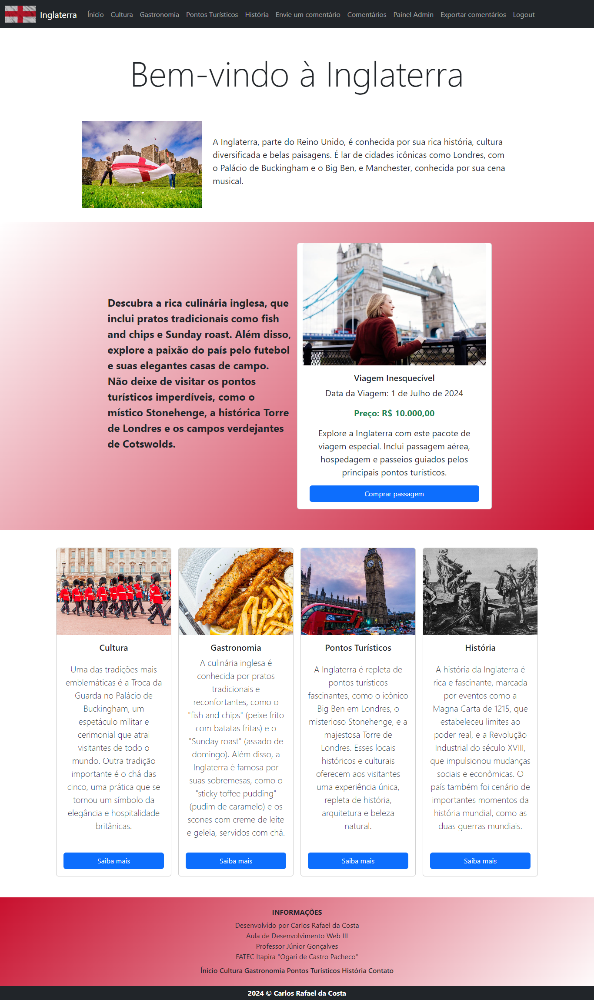
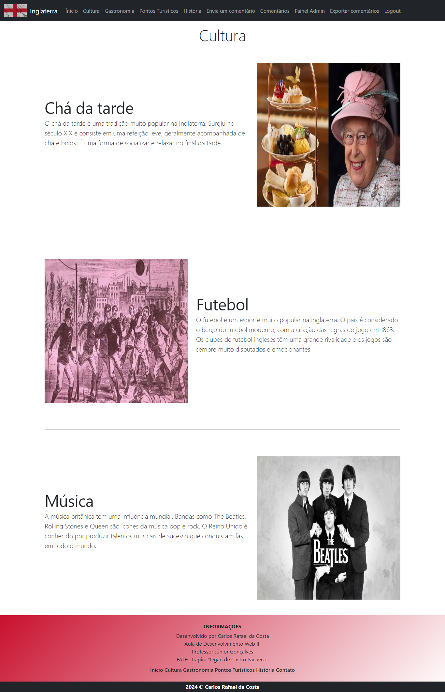
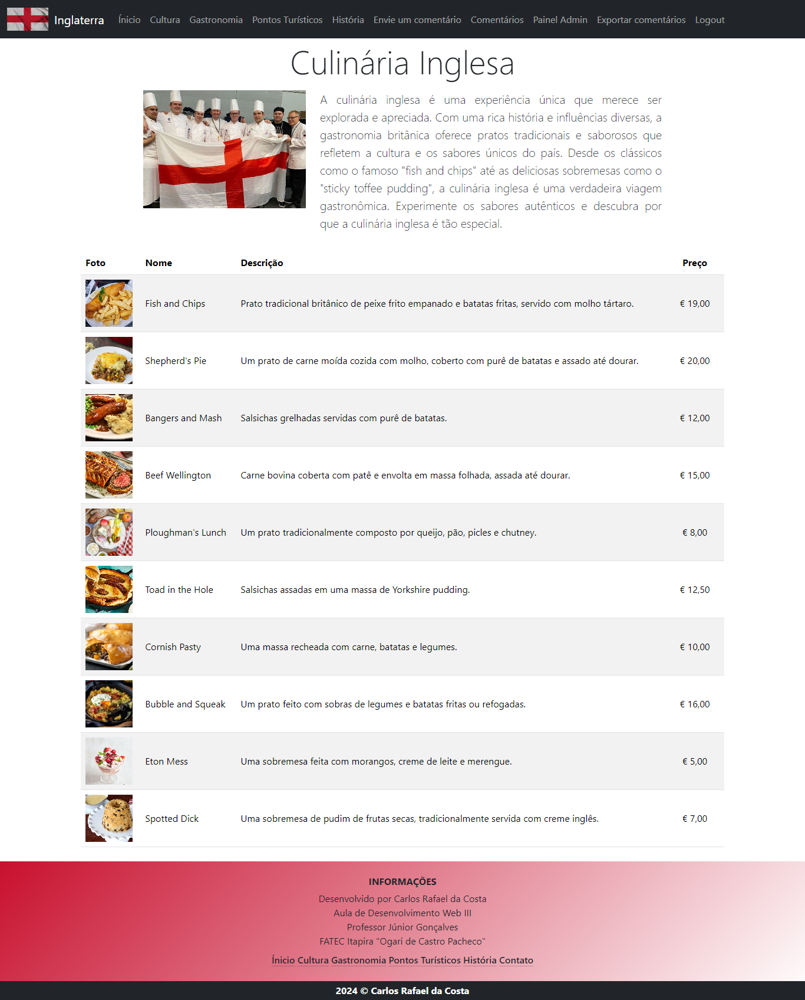
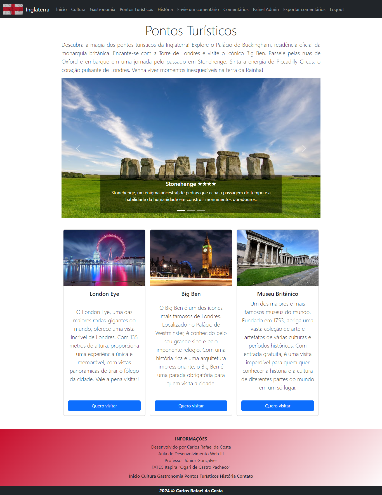
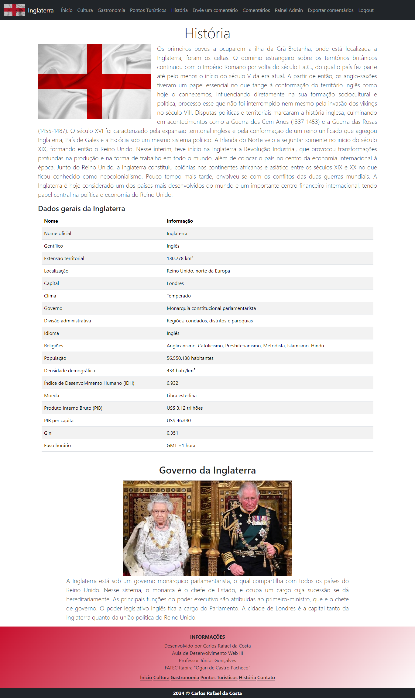
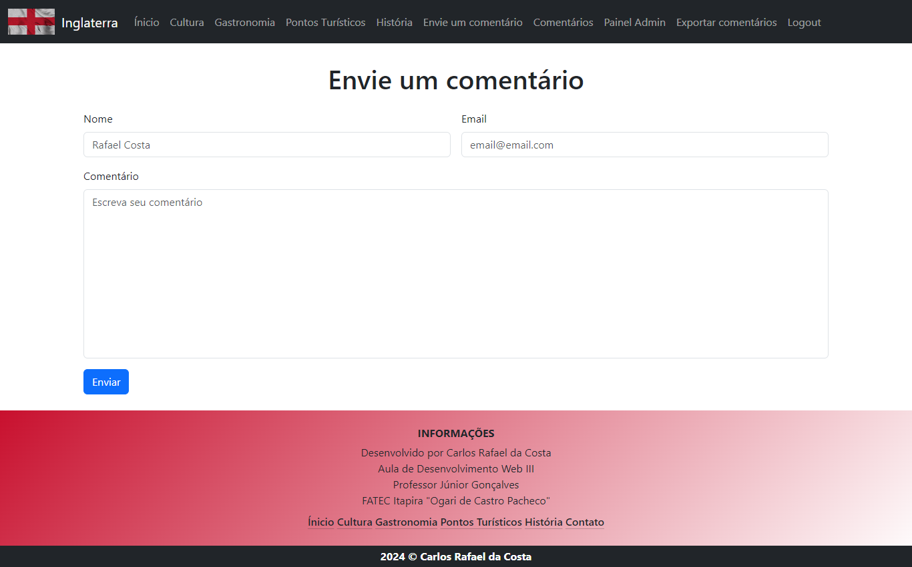
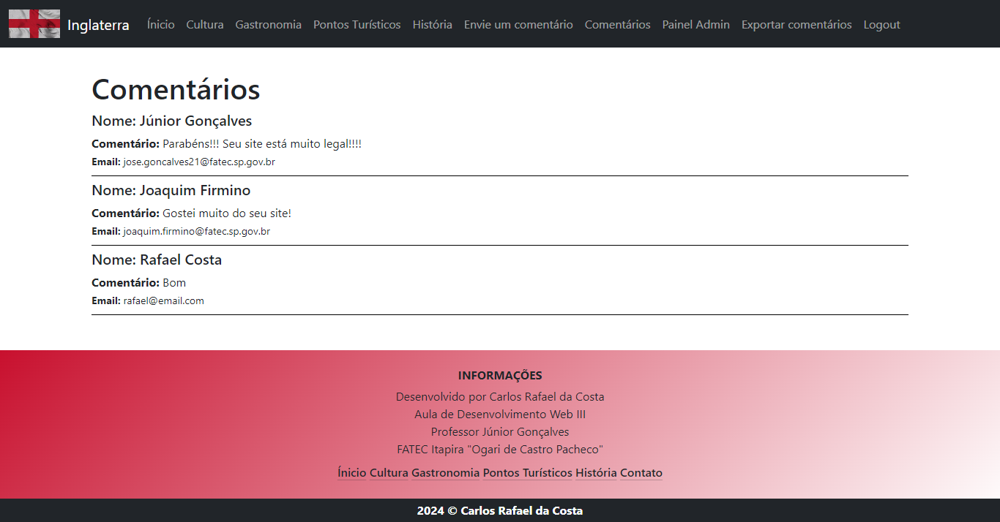
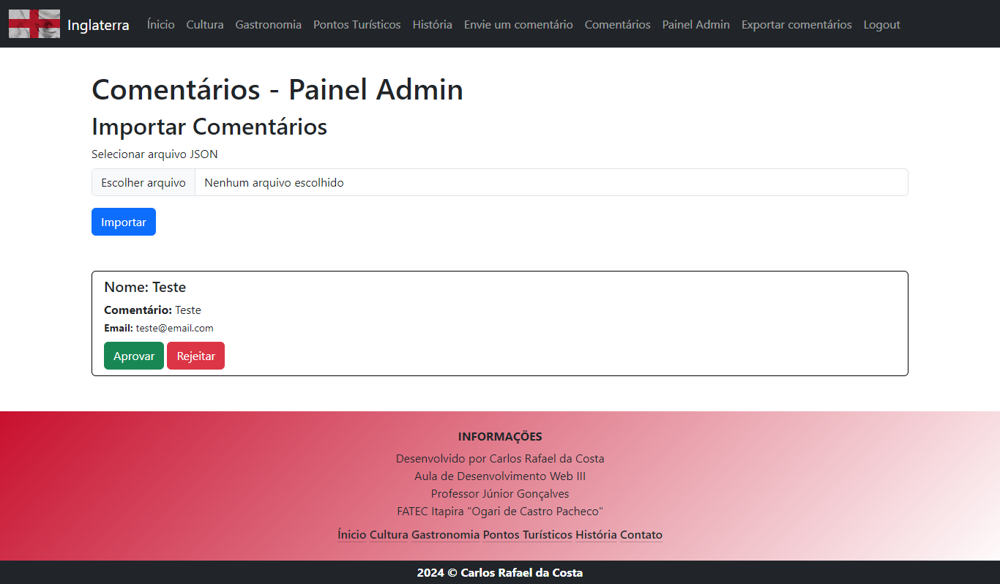
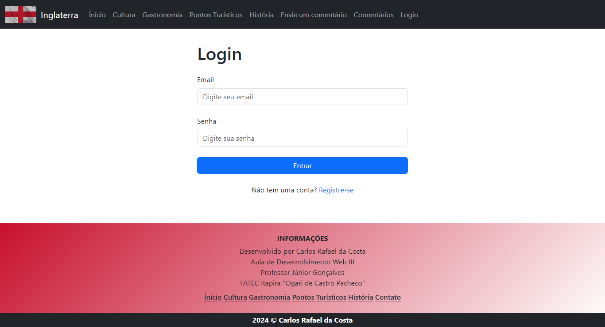
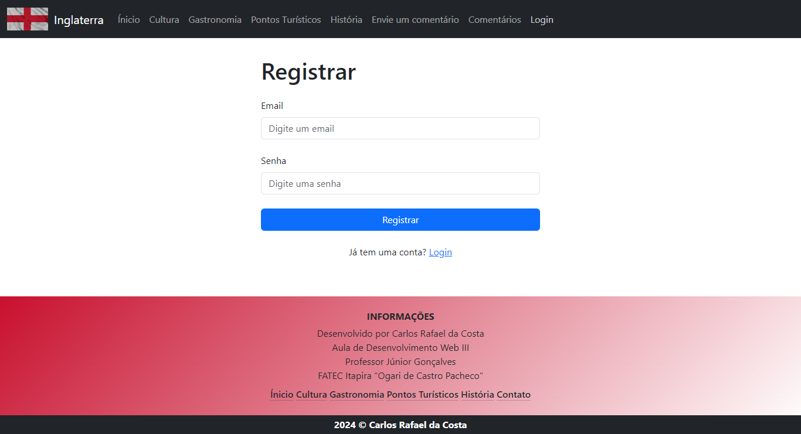

# Volta ao Mundo Inglaterra 🌍

## Visão Geral

O projeto "Volta ao Mundo Inglaterra" foi criado para explorar a riqueza cultural, gastronômica, turística e histórica da Inglaterra. Com um design simples e elegante, o site foi desenvolvido utilizando o framework Bootstrap, garantindo uma experiência visualmente atraente e responsiva em todas as páginas.

## Páginas Principais

### Página Inicial

A página inicial recebe os visitantes com um breve texto introdutório sobre a Inglaterra, seguido por um convite para explorar o país através de cards informativos e atrativos.

### Cultura

Nesta seção, mergulhe na fascinante cultura inglesa através de elementos visuais e textuais que destacam a diversidade e a tradição do país.

### Gastronomia

Descubra os sabores da Inglaterra nesta seção, que apresenta uma seleção de pratos tradicionais acompanhados de imagens apetitosas e descrições cativantes.

### Pontos Turísticos

Explore os principais pontos turísticos da Inglaterra em um carrossel de imagens que capturam a beleza e a história desses locais imperdíveis.

### História

Aprofunde-se na rica história da Inglaterra, desde seus primórdios até os dias atuais, com informações e curiosidades sobre a monarquia e outros aspectos históricos.

### Envie um comentário

Envie um comentário preenchendo o formulário disponível nesta seção.

### Comentários

Veja os comentários dos nossos usuários.

### Painel Admin

Área administrativa para importação e gerenciamento de comentários.

### Login | Registrar

Faça o login ou se registre uma conta em nosso site

## Fontes e Links Úteis

- [Wikipédia - Inglaterra](https://pt.wikipedia.org/wiki/Inglaterra)
- [Brasil Escola - Inglaterra](https://brasilescola.uol.com.br/ingles/inglaterra.htm)
- [Unsplash](https://unsplash.com/pt-br)
- [Google](https://www.google.com.br)
- [Bootstrap Documentation](https://getbootstrap.com/docs)
- [Instituto Britânico - Curiosidades sobre a cultura inglesa](https://institutobritanico.com.br/blog/5-curiosidades-sobre-cultura-inglesa-que-voce-precisa-conhecer)
- [Figma - Design do projeto](https://www.figma.com/file/0rv9Ea2cK5hOJcrhqnaLyp/Volta-ao-mundo-Inglaterra?type=design&node-id=2%3A5&mode=design&t=uC56dvdQxk5vsbLQ-1)
